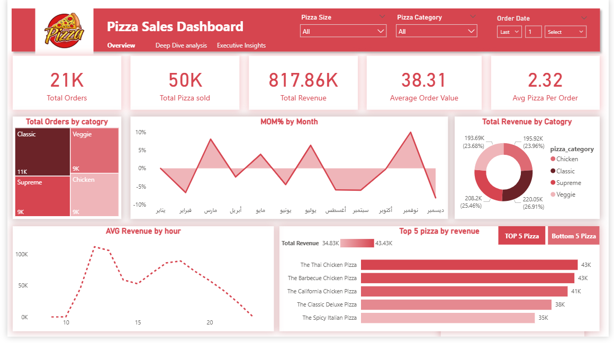

# 🍕pizza-sales-data-analysis
Pizza Sales Data Analysis is a BI project using Excel and Power BI. It explores sales performance, customer buying patterns, and product profitability. The dashboard highlights KPIs like orders, revenue, margins, and average order value, providing actionable insights for decision-making.

# pizza sales data analysis

## 📈 Key Metrics
- **21K** Total Orders  
- **50K** Total Pizzas Sold  
- **817.86K** Total Revenue  
- **38.31** Average Order Value  
- **2.32** Avg Pizza Per Order  
- **49.07K** Total Margin  
- **16.49** Avg Price per Size  

---

## 📊 Dashboards
The dashboard is divided into three main sections:
1. **Overview** → Sales summary, revenue by category, orders by size.  
2. **Deep Dive Analysis** → MOM% growth, hourly revenue trends, daily order distribution.  
3. **Executive Insights** → Top 5 pizzas by revenue and margin, customer buying patterns, revenue forecast.  

---

## 🛠 Tools Used
- **Excel** → Data cleaning & preparation.  
- **Power BI** → Dashboard creation & visualization.  
- **Data Validation** → Ensuring data accuracy before analysis.  

---

## 💡 Business Insights
- **Classic + Veggie** is the top-selling combo.  
- **Chicken + Supreme** is the least popular combo.  
- Sales peak on **Fridays and Saturdays**.  
- **Thai Chicken Pizza** and **Barbecue Chicken Pizza** lead in revenue and margin.  
- Average order contains **2 pizzas**.
  
## 🚀 How to Use
1. Download the `.pbix` file and open it in Power BI.  
2. Use filters (Pizza Size, Category, Date) to explore the dashboards.  
3. Check Excel files for raw data reference.  
4. Review screenshots for a quick overview of results.

   ## 📂 Project Structure
Pizza-Sales-Data-Analysis/
│
├── PIZZA DATA/          # Excel file(s)
│   └── pizza_sales_excel_file.xlsx
│
├── PIZZA DASHBOARD/     # Power BI file
│   └── pizza_sales_dashboard.pbix
│
├── PIZZA IMAGES/        # Screenshots
│   ├── overview.png
│   ├── deep analysis.png
│   └── excutive.png
│
└── README.md            # Documentation

